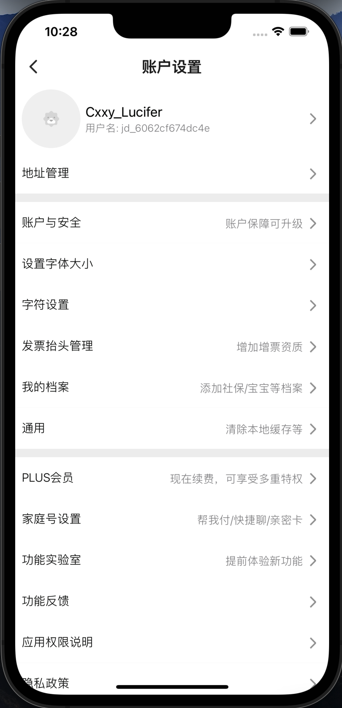

# 前言
该工程为android_mall的react-native子页面工程，基于0.69.0版本
- 我的设置

# 用户设置


# 目录说明：
```
├── android                    原生android工程
├── bundle                     打包生成目录
├── dist                       打包生成的中间目录
├── ios                        原生ios工程
├── mock                       模拟接口目录
├── src
│   ├── components             通用组件目录
│   ├── config                 环境配置
│   ├── http                   封装的axios库
│   ├── images                 图片
│   ├── kit                    工具
│   ├── pages                  页面目录
│   │   ├── selling-list       榜单
│   │   └── test-page          测试
│   ├── store
│   ├── index.tsx
│   └── routes.ts              路由信息
├── typings
│   └── global.d.ts            全局类型声明
├── .babelrc
├── .eslintrc.js
├── .gitignore
├── .npmrc
├── .prettierrc
├──  index.js                   入口
├── .package.json
├── .readme.md
└── .tsconfig.json
```

安装依赖
```bash
npm run install
```
运行安卓
```bash
npm run android
```
运行苹果
```bash
npm run ios
```

# 问题
1、[Typedef redefinition with different types ('uint8_t' (aka 'unsigned char') vs 'enum clockid_t'](https://github.com/facebook/flipper/issues/834)
2、[xcode13.3 Typedef redefinition with different types ('uint8_t' (aka 'unsigned char') vs 'enum clockid_t'](https://github.com/facebook/react-native/issues/31480)

# 打包
```bash
npm run build
```

# 配置规则
1、设置页面: https://com.aries.com?pageCode=rn&bundleName=app&initRouteName=UserSetting
- 参数说明: bundleName(为后期多bundle留标识)

## 图片上传地址 (图片名称要加时间戳，重名会被覆盖)
- [pre地址](http://ossppre.cnsuning.com/snoss-web/web/index.html#/bucketDetail/attribute/sffe/sffe/9I84291O113FAJOA/2AzZvNLwv4k5nx0oaaa3VkPdnZM=/1)
- [prd地址](http://osspprd1.cnsuning.com/snoss-web/web/index.html#/bucketDetail/attribute/sffe/sffe/MZACL9NM2BKC0OLZ/8OZku7KVWjA__Ycl9bMqMlgCwkc=/1)


